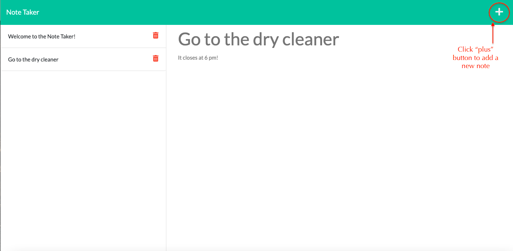
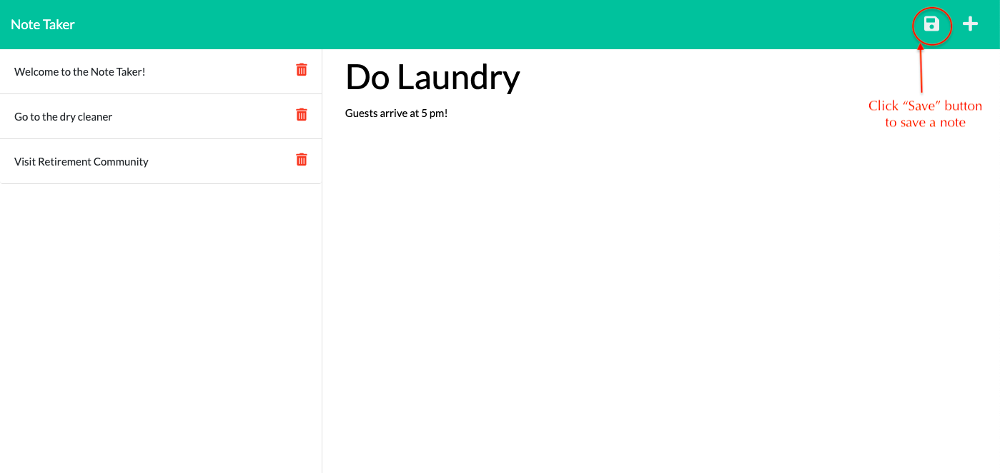
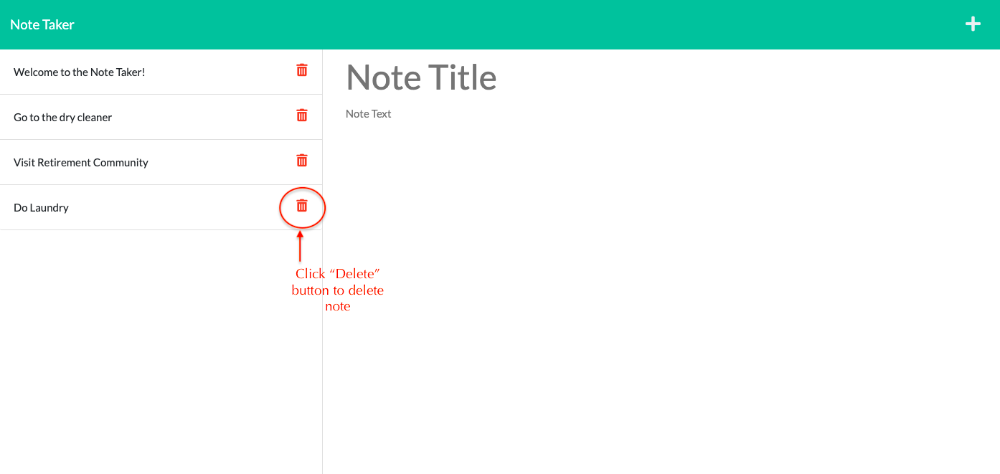
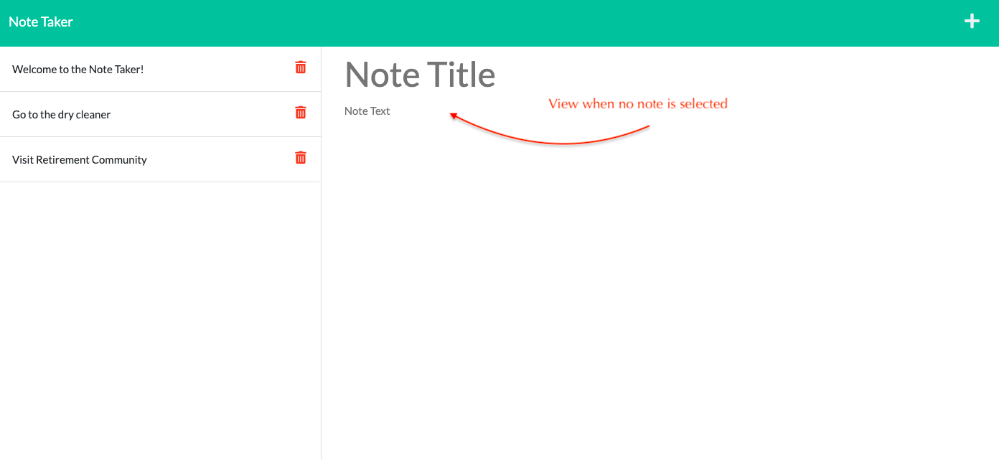

# Note-Taker

## Description

An application that can be used to write and save notes. It uses Express.js back end, saves and retrieves note data from a JSON file, and is deployed on Heroku.

**Tools & Skills Used**<br>
Node.js, Express.js, JSON, and Heroku.

## User Story

```
AS A small business owner
I WANT to be able to write and save notes
SO THAT I can organize my thoughts and keep track of tasks I need to complete
```

## Acceptance Criteria

```
GIVEN a note-taking application
WHEN I open the Note Taker
THEN I am presented with a landing page with a link to a notes page
WHEN I click on the link to the notes page
THEN I am presented with a page with existing notes listed in the left-hand column, plus empty fields to enter a new note title and the note’s text in the right-hand column
WHEN I enter a new note title and the note’s text
THEN a Save icon appears in the navigation at the top of the page
WHEN I click on the Save icon
THEN the new note I have entered is saved and appears in the left-hand column with the other existing notes
WHEN I click on an existing note in the list in the left-hand column
THEN that note appears in the right-hand column
WHEN I click on the Write icon in the navigation at the top of the page
THEN I am presented with empty fields to enter a new note title and the note’s text in the right-hand column
```

## Table of Contents

- [Installation](#installation)
- [Usage](#usage)
- [Credits](#credits)
- [License](#license)
- [Contributing](#contributing)
- [Tests](#tests)
- [Links](#links)
- [Questions](#questions)

## Installation

No installation necessary. This application can be run from the browser using the live link in the "Links" section.

## Usage

Please see below for examples of this application's usage:

### Screenshots of application:






### Video of Usage:


## Credits

- https://devcenter.heroku.com/articles/getting-started-with-nodejs?singlepage=true#deploy-the-app
- https://www.section.io/engineering-education/a-raw-nodejs-rest-api-without-frameworks-such-as-express/
- https://www.tabnine.com/code/javascript/functions/express/Router/delete
- https://expressjs.com/en/guide/routing.html
- https://www.youtube.com/watch?v=K9jTQPb0Xso&ab_channel=BrettM
- https://www.youtube.com/watch?v=aZ16pkrMkZE&ab_channel=TraversyMedia
- https://www.youtube.com/watch?v=pKd0Rpw7O48&t=3153s&ab_channel=ProgrammingwithMosh
- https://coding-boot-camp.github.io/full-stack/github/professional-readme-guide

## License

[](https://opensource.org/licenses/MIT)<br/>

    MIT License

    Copyright (c) 2021 COLLEEN FIMISTER

    Permission is hereby granted, free of charge, to any person obtaining a copy
    of this software and associated documentation files (the "Software"), to deal
    in the Software without restriction, including without limitation the rights
    to use, copy, modify, merge, publish, distribute, sublicense, and/or sell
    copies of the Software, and to permit persons to whom the Software is
    furnished to do so, subject to the following conditions:

    The above copyright notice and this permission notice shall be included in all
    copies or substantial portions of the Software.

    THE SOFTWARE IS PROVIDED "AS IS", WITHOUT WARRANTY OF ANY KIND, EXPRESS OR
    IMPLIED, INCLUDING BUT NOT LIMITED TO THE WARRANTIES OF MERCHANTABILITY,
    FITNESS FOR A PARTICULAR PURPOSE AND NONINFRINGEMENT. IN NO EVENT SHALL THE
    AUTHORS OR COPYRIGHT HOLDERS BE LIABLE FOR ANY CLAIM, DAMAGES OR OTHER
    LIABILITY, WHETHER IN AN ACTION OF CONTRACT, TORT OR OTHERWISE, ARISING FROM,
    OUT OF OR IN CONNECTION WITH THE SOFTWARE OR THE USE OR OTHER DEALINGS IN THE
    SOFTWARE.

## Contributing

No contributions needed at this time, but please feel free to contact me at my email address below if you would like to contact me about this project.

## Tests

Tests can be completed using [Jest](https://www.npmjs.com/package/jest).

## Links

[Heroku Live Link](https://guarded-tundra-54477.herokuapp.com/)

[GitHub Link](https://github.com/carlincb/Note-Taker)

## Questions

If you have questions, please contact me at carlin.colleen@gmail.com or find me at https://github.com/carlincb.
